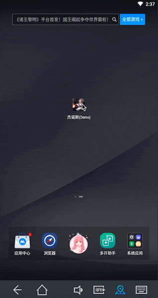

# Genos(杰诺斯)

Android开发插件管理工具。

**杰诺斯本身不具备任何吊炸天的能力, 只有装配了合适的能力才能发挥其真正的实力。** 而我们Android开发者就是Genos(杰诺斯)的库赛诺博士!

-------------------

<details>
<summary>展开查看杰诺斯背景故事</summary>
<pre>
杰诺斯是日本漫画作品《一拳超人》（日语：ワンパンマン）中的男二号，由库斯诺博士改造的半机械人，埼玉的弟子。现年19岁，真名不详, 外形俊朗青年男性。在与蚊女一战时见识到埼玉轻松打倒对手后拜他为师，对他十分信任且忠诚。性格认真，言论方面有时候不太礼貌，但唯独对埼玉奉若神明，尊称其为“老师”，会将埼玉说过的话记录在笔记本中，如果他人对埼玉恶言相向或者藐视会非常生气。在故事开始的四年前，杰诺斯的家人被改造人杀死，而他自己也濒临死亡，库赛诺博士将他进行改造，让他成为全身搭载武器的改造人，因此对暴走改造人复仇是他的目标。他在英雄协会的测验中获得优秀成绩，以最高级别（S级）加入。------from wikipedia
</pre>
</details>


## 效果展示

我在demo里写了三个简单的Capability(能力), 我们来看一下效果展示:




第一次打开App需要授予Genos悬浮窗权限(否则你在App的这一次生命周期里就看不到它了), 授予完点击返回按钮回到你的app里。

 - "简单": 简单响应点击。进阶操作: 跳转到你自定义插件的配置页, 拥抱无限的想象力吧骚年。
 - "开关": 简单开关某项功能。适用于简单的调试功能的开启与关闭。进阶操作: 打开或关闭你用于监听程序相关数据的悬浮窗。
 - "当前Activity": 一个实用的简单例子, 用于查看当前位于顶部的Activity全类名。


## 依赖

现已加入jcenter

```groovy
debugImplementation 'wang.relish.genos:genos:1.0.0'
releaseImplementation 'wang.relish.genos:genos-nop:1.0.0'
```

## 自定义Capability(能力=插件)

### 1 无开关的能力(实现Capability接口)

```java
public class YourCapabilityName implements Capability {

    @Override
    public void onCapabilityPrepared(Context context, CapabilityCenter capabilityCenter) {
		// 当能力被装载到杰诺斯上时
    }

    @Override
    public String capabilityName() {
        return "your capability name";//能力名
    }

    @Override
    public void onCapabilityEmitted(View view) {
        // 点击了此能力
    }
}
```

### 2 有开关的能力(实现SwitchableCapability抽象类)

```java
public class YourCapabilityName extends SwitchableCapability {

    @Override
    public void onCapabilityPrepared(Context context, CapabilityCenter capabilityCenter) {
		// 当能力被装载到杰诺斯上时
    }

    @Override
    public String capabilityName() {
        return "your capability name";// 能力名
    }

    @Override
    public void onCapabilitySwitched(final CompoundButton button, final boolean isChecked) {
		// 当开关被切换
    }
}
```

### 主工程中为杰诺斯装载能力

**装载能力**
一般来说先装载各项能力,再启动杰诺斯, 实际上先后都没有关系(先挂载的能力, 会出现在列表前面)

```java
Genos.equip(customCapability);
```

**启动杰诺斯**

```java
Genos.launch(application);
```

#### GenosBrain(杰诺斯之脑)

用于控制杰诺斯的各项能力

```java
/**
 * 显示{@link Genos#mGenosWindow 杰诺斯悬浮球}
 */
void show();

/**
 * 隐藏{@link Genos#mGenosWindow 杰诺斯悬浮球}
 */
void hide();

/**
 * {@link Genos#mGenosWindow 杰诺斯悬浮球}是否显示
 *
 * @return true-显示;false-隐藏
 */
boolean isShown();

/**
 * 启用{@link Genos 杰诺斯}的某项能力
 *
 * @param capabilityName 能力名
 * @see Capability#capabilityName()
 */
void enable(String capabilityName);

/**
 * 禁用{@link Genos 杰诺斯}的某项能力
 *
 * @param capabilityName 能力名
 * @see Capability#capabilityName()
 */
void disable(String capabilityName);

/**
 * 获取{@link Genos 杰诺斯}所在的当前Activity的全类名(含包名)
 *
 * @return 当前Activity的全类名
 */
String getTopAtyFullName();
```

## 混淆

无

## 致谢

感谢[alipay/SoloPi](https://github.com/alipay/SoloPi)提供的权限适配方案.

